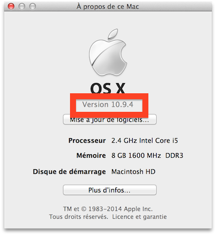
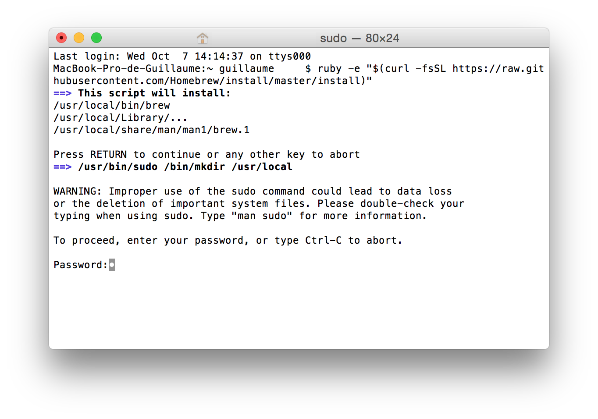

# Installation de Middleman sur Mac OS X

L'installation de Middleman se fait en plusieurs étapes. Merci de les
suivre scrupuleusement dans l'ordre.

## Mise à jour de Mac OS X

Vérifiez votre version de Mac. Cliquez su la pomme en haut à gauche de l'écran,
puis sélectionnez "À propos de ce Mac". Vous devrier voir apparaître une fenêtre
d'information. Ce qui nous intéresse, c'est la version de Mac.




Si votre numéro de version commence par **10.6**, **10.7** ou **10.8**, votre Mac
n'a pas la dernière version du système d'exploitation Apple, à savoir **Yosemite**.
Si le numéro de version commence par **10.10**, pouvez passer à l'étape suivante directement.

Vous pouvez le télécharger gratuitement sur [cette page](https://itunes.apple.com/fr/app/os-x-yosemite/id675248567?mt=12). Vous allez ouvrir l'App Store, et pouvoir télécharger
le logiciel. Il s'installera automatiquement (cela peut prendre plusieurs heures en
fonction de votre connexion Internet).

## Installation des outils de compilation

Ouvrez le terminal. N'ayez pas peur, c'est la fenêtre blanche avec écriture noire
par dessus. Vous pouvez y taper des commandes, faire Entrée, et l'ordinateur va exécuter
la commande que vous avez tapée.


Une fois le terminal ouvert, copiez-la ligne ci-dessous et appuyez sur Entrée :

```bash
xcode-select --install
```

Une fenêtre devrait s'ouvrir, Cliquez sur "Installer".


Vous devez accepter la license, puis attendre que le téléchargement et
l'installation se termine (300 Mo environ).

## Installation de Middleman

Attendez bien que l'étape précédente soit complétée. Si vous avez fermé le terminal, réouvrez-le.
Copiez-collez les commandes suivantes dans le terminal, puis appuyez sur Entrée :

### Étape 1 - Homebrew

```bash
ruby -e "$(curl -fsSL https://raw.githubusercontent.com/Homebrew/install/master/install)"
```

Ce script va vous demander une confirmation (`Press RETURN`), confirmez en tapant une deuxième fois
sur la touche Entrée.

Ensuite, il va vous demander votre mot de passe. Il s'agit du **mot de passe de votre Mac**,
celui que vous renseignez lorsque vous ouvrez votre session. Si vous tapez et vous ne voyez rien s'afficher,
**c'est normal**, votre Mac ne bug pas, il prend bien en compte les caractères. Appuyez
sur Entrée quand vous avez terminé de taper votre mot de passe.

**Si vous n'avez pas de mot de passe de session**, appuyez juste sur Entrée.



### Étape 2 - Oh-my-zsh

Même chose, il va (sans doute) vous demander votre mot de passe :

```bash
rm -rf ~/.oh-my-zsh
curl -L https://raw.githubusercontent.com/robbyrussell/oh-my-zsh/master/tools/install.sh | bash
zsh
```

Vous devriez avoir un terminal qui ressembe à ceci:


Si ce n'est pas le cas, quittez (`⌘Q`) le terminal, et relancez-le. Si ce n'est toujours pas le cas,
recommencez l'étape 2.

### Étape 3 - Ruby

Dans le terminal, copiez-collez les lignes suivantes:

```bash
echo 'export RBENV_ROOT="${HOME}/.rbenv"'                           >> ${HOME}/.zshrc
echo 'export PATH="./bin:${RBENV_ROOT}/bin:${PATH}"'                >> ${HOME}/.zshrc
echo 'if which rbenv > /dev/null; then eval "$(rbenv init -)"; fi'  >> ${HOME}/.zshrc
echo 'export LANG=en_US.UTF-8'                                      >> ${HOME}/.zshrc
echo 'export LC_ALL=en_US.UTF-8'                                    >> ${HOME}/.zshrc
source ${HOME}/.zshrc
```

Quittez (`⌘Q`) le terminal, puis relancez-le. Tapez ensuite :

```bash
curl https://raw.githubusercontent.com/fesplugas/rbenv-installer/master/bin/rbenv-installer | bash
```

Enfin :

```bash
rbenv install 2.2.3 && rbenv global 2.2.3
```

Quittez (`⌘Q`) le terminal, puis relancez-le. Tapez ensuite :

```bash
ruby -v
```

Vous devriez voir la version `2.2.3` de Ruby, et **non pas** `2.0.0`.

### Étape 4 - Middleman

Maintenant, tapez ceci :

```
gem install bundler middleman
```

### Étape 5 - Vérification

Pour vérifier que c'est bon, tapez dans le terminal:

```bash
middleman version
```

Si le résultat est "Middleman 3.4.0" ou plus, bravo ! Vous êtes prêt à utiliser [Middleman](https://middlemanapp.com/).

## GitHub

Rendez-vous sur [desktop.github.com](https://desktop.github.com/) pour télécharger et installer l'application GitHub Desktop.

## Sublime Text

Téléchargez [Sublime Text 2](http://www.sublimetext.com/2) et installez-le (en le glissant dans le dossier `Applications`).
Ensuite, suivez [ce tutoriel](https://github.com/lewagon/setup/blob/master/_partials/sublime_text_preferences.md) pour configurer Sublime Text correctement.
