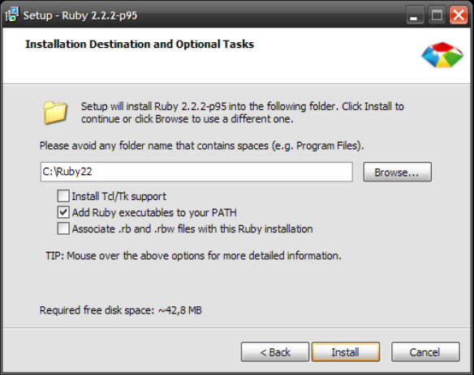
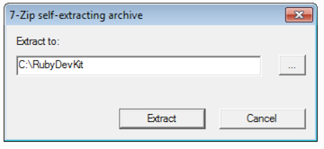

# Installation de Middleman sur Windows

## Ruby

Téléchargez et installez Ruby. Si vous ne savez pas quelle version choisir
ci-dessous, la première ira très bien :

- [Ruby 2.2.2](http://dl.bintray.com/oneclick/rubyinstaller/rubyinstaller-2.2.2.exe?direct)
- [Ruby 2.2.2 (64 bits)](http://dl.bintray.com/oneclick/rubyinstaller/rubyinstaller-2.2.2-x64.exe?direct)

Une fois téléchargé, double cliquez sur l'installeur. Attention au moment de l'installation,
sur l'écran ci-dessous cochez la case du milieu:



## Devkit

Vous avez besoin d'installer un compilateur pour faire marcher Middleman. Ne vous inquiétez pas,
suivez la procédure suivante. Téléchargez l'un des installateurs ci-dessous :

- [Devkit](http://cdn.rubyinstaller.org/archives/devkits/DevKit-mingw64-32-4.7.2-20130224-1151-sfx.exe)
- [Devkit x64](http://cdn.rubyinstaller.org/archives/devkits/DevKit-mingw64-64-4.7.2-20130224-1432-sfx.exe)

Une fois téléchargé, double cliquez sur l'installateur. La fenêtre suivante va s'ouvrir :



Changez la destination d'extraction pré-remplie par `C:\RubyDevKit` et cliquez sur le bouton "Extract".

Ensuite, téléchargez le fichier [`rubygems-update-2.2.3.gem`](https://github.com/rubygems/rubygems/releases/download/v2.2.3/rubygems-update-2.2.3.gem)
et placez le dossier dans `C:\RubyDevKit`.

Maintenant, nous allons écrire des lignes de commande dans le terminal. Pour lancer le terminal, cliquez sur le bouton Démarrer en bas à gauche de Windows, et tapez `cmd`. Vous devriez voir apparaître le programme à lancer :


Alternativement vous pouvez également lancer "Windows PowerShell".

Une fois votre terminal lancé, vous pouvez commencer à taper des commandes. Commençons par
celle ci-dessous. Une fois la commande tapée, appuyez sur Entrée.

```bash
cd C:\RubyDevKit
```

Maintenant, tapez et executez les commandes suivantes successivement :

```bash
ruby dk.rb init
ruby dk.rb install
gem install --local rubygems-update-2.4.8.gem
update_rubygems --no-ri --no-rdoc
```

Tapez maintenant:

```
gem --version
```

Si le résultat affiché est 2.4.8, vous avez tout bon !

## Middleman

Maintenant vous pouvez rester dans le terminal et taper la commande suivante :

```bash
gem install bundler middleman
```

qui va vous installer Middleman. Attendez que le script se termine (cela prend un peu de temps). Pour vérifier que c'est bon, tapez dans le terminal:

```bash
middleman version
```

Si le résultat est "Middleman 3.3.12" ou plus, bravo ! Vous êtes prêt à utiliser [Middleman](https://middlemanapp.com/).

## GitHub

Rendez-vous sur [windows.github.com](http://windows.github.com), téléchargez le logiciel est installez-le.


## Sublime Text

Téléchargez [Sublime Text 2](http://www.sublimetext.com/2) et installez-le.
Ensuite, suivez [ce tutoriel](https://github.com/lewagon/setup/blob/master/_partials/sublime_text_preferences.md) pour configurer Sublime Text correctement.
